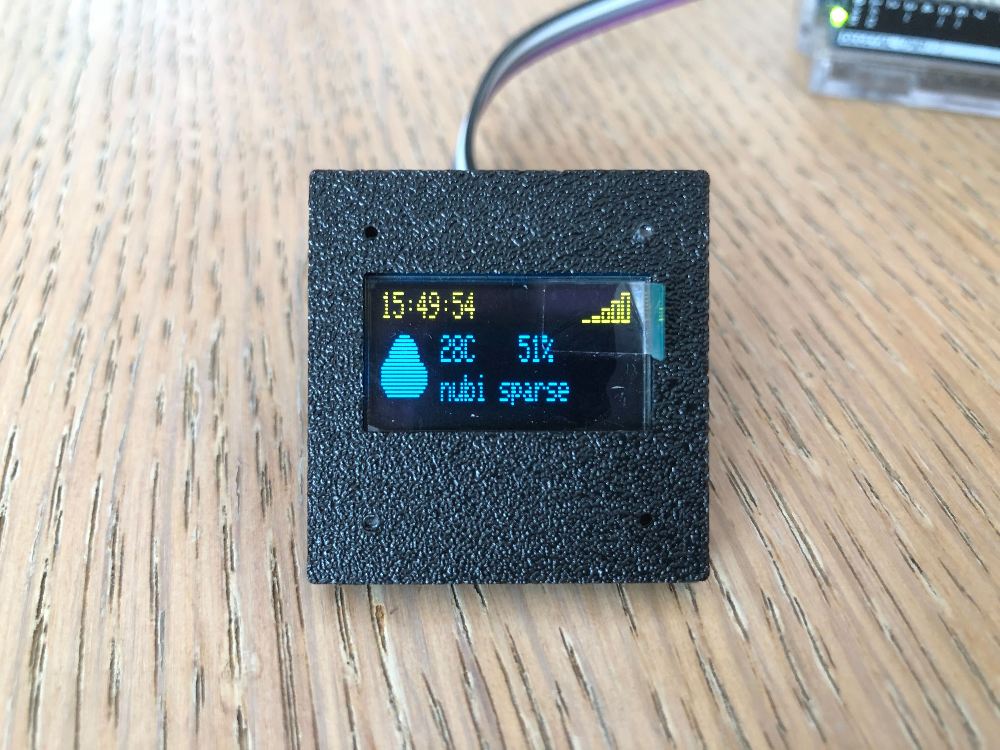

# Arduino Weather Station 🌦️

[](https://github.com/EXELVI/Arduino_Weather_Station)

[](https://github.com/EXELVI/Arduino_Weather_Station/stargazers)
[](https://github.com/EXELVI/Arduino_Weather_Station)
[](https://github.com/EXELVI/Arduino_Weather_Station/issues)
[](https://github.com/EXELVI/Arduino_Weather_Station/commits/main)

Welcome to my Arduino Weather Station project! This project creates a weather display using an Arduino, an OLED display. It fetches weather data from OpenWeatherMap and displays it on an OLED screen, showing temperature, humidity, and weather conditions.

## 🛠️ Features

- **Real-time Weather Data:** Fetches current weather data from OpenWeatherMap API.
- **OLED Display:** Shows weather information and icons on a small OLED screen.
- **WiFi Connectivity:** Connects to WiFi to retrieve weather data and update the display.
- **Real-Time Clock (RTC):** Displays current time and date.

## 📦 Installation

1. **Clone the Repository:**

   ```bash
   git clone https://github.com/EXELVI/Arduino_Weather_Station.git
   ```

2. **Install Dependencies:**

   Ensure you have the following libraries installed in your Arduino IDE:

   - `Adafruit GFX` 
   - `Adafruit SSD1306`
   - `Arduino_JSON`
   - `NTPClient`
   - `WiFiS3`
   - `RTC`

   You can install these libraries through the Arduino Library Manager or manually from their respective repositories.

3. **Configure Secrets:**

   Create a file named `arduino_secrets.h` and add your WiFi credentials and OpenWeatherMap API key:

   ```cpp
   #define SECRET_SSID "your_SSID"
   #define SECRET_PASS "your_PASSWORD"
   #define SECRET_API_KEY "your_API_KEY"
   #define SECRET_lat your_latitude
   #define SECRET_lon your_longitude
   ```

## ⚙️ Usage

1. **Upload the Code:**

   Open the `index.html` file in your Arduino IDE and upload the code to your Arduino board.

2. **Connect to WiFi:**

   The Arduino will attempt to connect to the specified WiFi network. Ensure your credentials are correct and the network is available.

3. **View Weather Data:**

   Once connected, the Arduino will fetch and display weather data on the OLED screen. The display will show the current temperature, humidity, and weather conditions with corresponding icons.

## 🔧 Troubleshooting

- **WiFi Connection Issues:** Ensure your SSID and password are correct. Check the signal strength and router settings.
- **Library Errors:** Make sure all required libraries are installed and up-to-date.
- **API Key Issues:** Verify your OpenWeatherMap API key and ensure it has the necessary permissions.

## 🤝 Contributing

Feel free to contribute to this project by reporting issues, suggesting features, or submitting pull requests. Any feedback or ideas are welcome!
